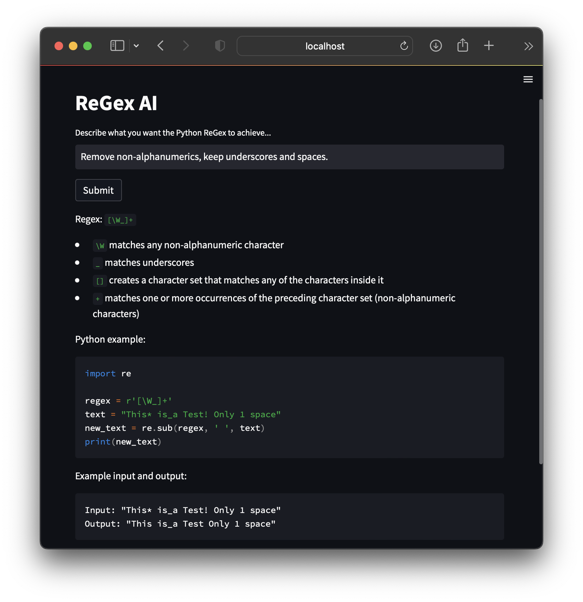

# ReGex-AI
Generate Python ReGex expressions using GPT 3.

[Try the live demo](https://georgeamccarthy-regex-ai-regex-ai-vsn18o.streamlit.app/) (may take a few minutes to reboot).

Describe what you want the ReGex to achieve and GPT-3 will try to:
- Provide a ReGex expression compatible with Python.
- Break down how the expression works.
- Provide an example use case written in Python.
- Give an example input and output for that code.

Disclaimer: This is a proof of concept - it sometimes gives bad answers.
